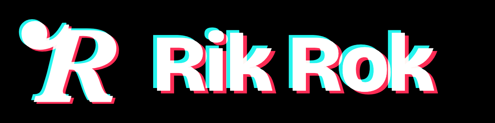
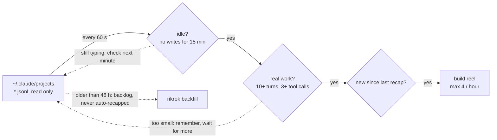
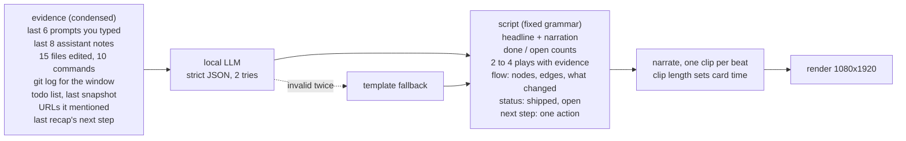
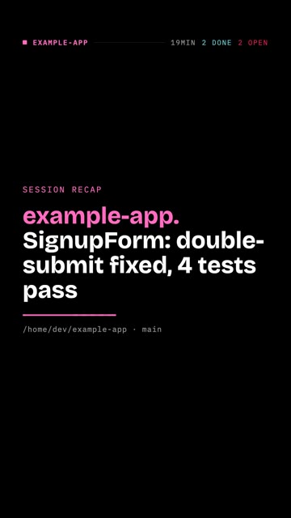
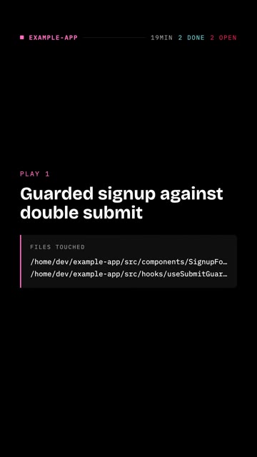
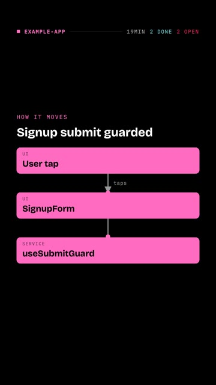
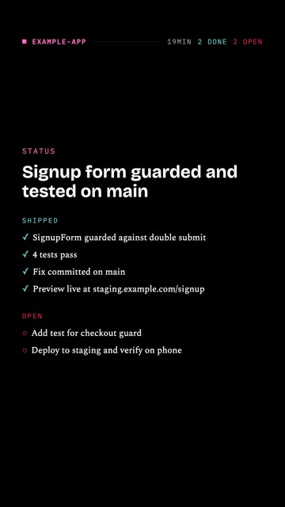
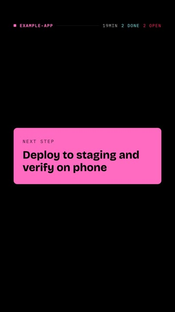

<p align="center"></p>

# Rik Rok

Tired of running six Claude Code or Codex sessions, then going back through every one to work out what it did and put yourself back in the loop?

Imagine if your recaps came at you the same way you doomscroll.

Welcome to Rik Rok.

Rik Rok watches your coding-agent sessions. When one goes idle after real work, it writes a 30 to 45 second news-style recap, narrates it, renders a vertical reel, and drops it into a swipe feed on your phone. Every reel ends with the single next step for that project, and when the session changed how something moves, the reel shows the flow. Reply to a reel and the comment can go straight back to the agent.

Everything runs on your machine. Sessions are read from disk, scripts come from a local LLM, narration from a local voice, rendering from Remotion. No cloud, no accounts, no telemetry.

## Quickstart (macOS)

```bash
npm install -g rikrok        # or: npx rikrok ...
rikrok doctor                # checks ffmpeg, sessions, LLM, voice, render browser
```

Point it at a local LLM. Ollama is the default:

```bash
ollama pull qwen3:8b
export RIKROK_LLM_MODEL=qwen3:8b
export RIKROK_LLM_EXTRA='{"think":false}'    # thinking models: keep the JSON clean
```

Then:

```bash
rikrok backfill --limit 3    # recap your 3 most recent sessions now
rikrok feed                  # http://127.0.0.1:4870
```

Open the feed, tap Start scrolling, swipe. To keep it running at login:

```bash
rikrok install               # launchd agents for the watcher and the feed
```

No LLM yet? Everything still works: reels use a plain template script built from commits, files and todos. Set the model later.

Want to see one first? `rikrok demo` renders a reel from a bundled sample session.

## When does a session earn a reel?

The watcher never reads a session while you are in it. It waits for silence, checks there was real work, then builds. Five numbers decide everything.



| Rule | Value | Why |
|---|---|---|
| Idle bar | 15 min | No new lines in the log. A resumed session that goes quiet again gets a second reel covering only the new lines. |
| Real work | 10 assistant turns, 3 tool calls | Below this the session is remembered but skipped, so a quick question never becomes a reel. |
| Backlog cutoff | 48 h | Older sessions are history, not news. The first run backfills the 10 most recent instead. |
| Rate limit | 4 an hour | A reel costs an LLM call, a handful of voice clips and a render. The rest queue for the next scan. |
| Retries | 5 | LLM or voice server down: back off 2, 4, 8, 16, 32 minutes, then give up for this idle period. |

All five are settings (`RIKROK_IDLE_MINUTES`, `RIKROK_MIN_TURNS`, `RIKROK_MIN_TOOLS`, `RIKROK_MAX_PER_HOUR`).

## What goes into the script?

The log is condensed to about a page of evidence and handed to your local model with a fixed grammar. If the model fails twice, a template writes the same shape from the raw facts. A reel always ships.



The script is the only creative step. Everything after it is timing: each card stays up as long as its narration runs, never under 2.2 seconds.

## The reel, beat by beat

Frames from the demo reel (a sample session). Every reel has this order; only the number of plays varies, two to four, and the flow beat appears only when the session changed how something moves.

| Beat | Frame | What it shows | Where it comes from |
|---|---|---|---|
| **Headline** |  | The outcome up front. Project name in its fixed accent colour, the one-line result, and a score bug: minutes active, done, open. Under it, the repo path and branch. | Headline and narration from the model. Path, branch and minutes are facts from the log. |
| **Play** (2 to 4) |  | One thing that happened. A caption plus an evidence panel: files touched, commit lines, commands or a quote. Lines animate in one by one. | The model picks the plays. Evidence lines must come from the log, never invented. |
| **How it moves** |  | The flow the session built or changed: a user action reaching an API, data written somewhere, a job firing. Nodes in the order things happen, arrows drawn in as the narration reaches them, a dot travelling each arrow, the changed parts lit in the accent. | The model returns nodes and edges backed by the session. Off with `RIKROK_FLOW=off`. |
| **Status** |  | Where it stands. Shipped in cyan with ticks, open in red with circles. If the previous recap named a next step, the narration says whether it happened. | Up to 4 shipped and 3 open items from the model; the counts feed the score bug. |
| **Next step** |  | The single next action on an accent card. Also printed under the reel in the feed, so you can act without replaying. | One action, max 60 characters, from the model. |

## What you can do on a reel

| Action | How | What happens | Talks back to the agent? |
|---|---|---|---|
| Watched | double-tap, button, or 80% played | Reel drops below unwatched ones. Saved next to the video. | no |
| 2x | hold anywhere | Plays at double speed while held. | no |
| Comment | speech bubble | Saved to the reel, then handed to your hook with the session id, lines covered, newer recaps, and a resume hint. | yes, through `RIKROK_COMMENT_HOOK` |
| Archive | button | Hidden from the feed. The feed also auto-archives past 3 unwatched per project. | no |
| Chain | badge | Shows when a newer recap of the same session exists; tap jumps to it. | no |
| Details | button | Shipped, open, commits, URLs, copy path. | no |

## On your phone

The feed binds to `127.0.0.1` by default. To reach it from your phone, put it on a private network you already trust:

- Tailscale: `RIKROK_BIND=0.0.0.0 rikrok feed`, then open `http://<your-mac>.<tailnet>.ts.net:4870`. If your tailscaled runs in userspace mode, use `tailscale serve --bg --https=8445 http://127.0.0.1:4870` instead and open the https URL.
- Same Wi-Fi: `RIKROK_BIND=0.0.0.0 rikrok feed` and open `http://<mac-ip>:4870`.
- Behind a Cloudflare tunnel with Access in front works well too.

Add it to your home screen from the share sheet for the full-screen PWA. There is no login on the feed, so do not expose it to the public internet without something in front.

Data lives in `~/.rikrok` (reels, sidecar JSON, state, render bundle, logs). Delete it to start over.

## Configuration

Environment variables, or the same keys in `~/.rikrok/config.json`. `rikrok config` prints what is in effect.

| Variable | Default | What it does |
|---|---|---|
| `RIKROK_HOME` | `~/.rikrok` | Data directory |
| `RIKROK_CLAUDE_DIR` | `~/.claude/projects` | Where Claude Code keeps sessions |
| `RIKROK_LLM_URL` | `http://127.0.0.1:11434` | OpenAI-compatible chat server (Ollama, LM Studio, oMLX, vLLM) |
| `RIKROK_LLM_MODEL` | unset | Model name. Unset means template scripts only |
| `RIKROK_LLM_KEY` | unset | Bearer token if your server wants one |
| `RIKROK_LLM_EXTRA` | `{}` | JSON merged into every chat request, e.g. `{"think":false}` (Ollama) or `{"chat_template_kwargs":{"enable_thinking":false}}` (oMLX, vLLM) |
| `RIKROK_FLOW` | `on` | `off` drops the "how it moves" beat |
| `RIKROK_VOICE` | `say:Samantha` on macOS, else `none` | `say:<Voice>`, `openai-speech:<voice>`, `module:<path>`, `none` |
| `RIKROK_TTS_URL` / `_MODEL` / `_KEY` | LLM URL, `tts-1` | For `openai-speech`: any `/v1/audio/speech` server (Kokoro-FastAPI, oMLX Qwen3-TTS, LM Studio) |
| `RIKROK_VOICE_FX` | `none` | `light` or `strong` robot treatment |
| `RIKROK_STT_URL` / `_MODEL` / `_KEY` | unset | Enable transcribe-back QA via a `/v1/audio/transcriptions` server with word timestamps |
| `RIKROK_PORT` / `RIKROK_BIND` | `4870` / `127.0.0.1` | Feed address |
| `RIKROK_COMMENT_HOOK` | unset | Shell command run for every comment, JSON on stdin (see below) |
| `RIKROK_IDLE_MINUTES` / `_MIN_TURNS` / `_MIN_TOOLS` | `15` / `10` / `3` | What counts as a finished, meaningful session |
| `RIKROK_MAX_PER_HOUR` | `4` | Watcher rate limit |
| `RIKROK_PROJECT_NAME_RE` | unset | Regex with one capture group applied to the session cwd to name the project, e.g. `workspaces/([^/]+)/` for worktree layouts |
| `RIKROK_HANDLE` | unset | Handle shown on every reel |
| `RIKROK_BROWSER` | unset | Path to a Chrome or Chromium binary if you would rather not let Remotion download one |

### Voices

- `say:Samantha` (any voice from `say -v ?`): zero setup on a Mac.
- `openai-speech:<voice>`: point `RIKROK_TTS_URL` at a local speech server. Kokoro-FastAPI, oMLX with Qwen3-TTS presets, and LM Studio all speak this API.
- `module:/path/to/voice.mjs`: your own engine. Export `{ name, available(), synth(text, outWavPath) }`. This is how a private voice clone stays private.
- `none`: silent reels, captions carry the story.

If the configured voice is unavailable, Rik Rok falls back to `say`, then to silence, and says so in the sidecar.

### Comment hook

Set `RIKROK_COMMENT_HOOK` to any command. For each comment it receives JSON on stdin:

```json
{ "reelId": "…", "source": "claude", "sessionId": "…", "project": "my-app", "cwd": "/Users/me/my-app",
  "headline": "my-app: signup guarded", "coveredLines": { "from": 0, "to": 214 },
  "newerRecaps": [], "resumeHint": "claude --resume <id>", "comment": "also cover checkout", "at": "…" }
```

A hook that opens the session back up with your note:

```bash
RIKROK_COMMENT_HOOK='jq -r ".comment" | xargs -I{} claude --resume "$(jq -r .sessionId)" -p "{}"'
```

Comments are always saved to the reel's sidecar JSON as well.

## Privacy

Session content never leaves your machine unless you point `RIKROK_LLM_URL` or `RIKROK_TTS_URL` at a remote server. The reels themselves contain session content (file names, commit lines, what you asked for), so share them the way you would share a terminal recording.

## Requirements

- Node 20.19 or newer
- ffmpeg and ffprobe
- git
- A headless Chrome for rendering. Remotion downloads one on first use (a few hundred MB); `rikrok demo` triggers that download so the first real reel is not a surprise. If the download does not work on your machine, set `RIKROK_BROWSER` to any Chrome or Chromium.
- Remotion's licence applies to you as the user: free for individuals and for companies of up to three people, a paid company licence above that. See remotion.dev/license.

Linux: the watcher and feed run fine (`rikrok watch`, `rikrok feed`); `rikrok install` prints systemd user units instead of installing launchd agents. `say` is macOS only, so pick `openai-speech` or `none`.

## Roadmap

- Codex CLI sessions (`~/.codex/sessions`) as a second source. The source interface is already in place.
- Gemini CLI, OpenCode, Cursor.
- A screenshot of the running app as a play's visual when the session mentioned a live URL.
- Push notification when a reel lands.

## Development

```bash
git clone https://github.com/alexferrao/rikrok && cd rikrok && npm install
npm test                  # parse, script, flow and props tests on the fixture session
npm run demo              # full pipeline on the fixture: assets/demo.mp4
npm run studio            # Remotion studio for the composition
node scripts/gen-icon.mjs # regenerate the mark (macOS, needs Baskerville)
```

MIT.
