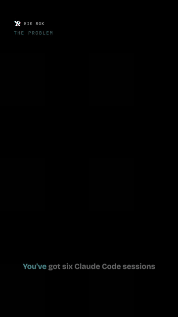
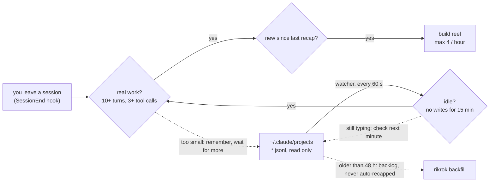
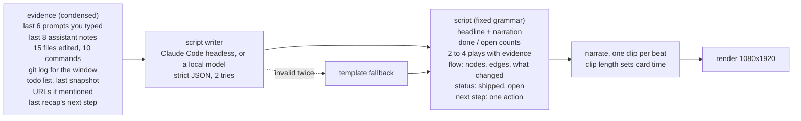
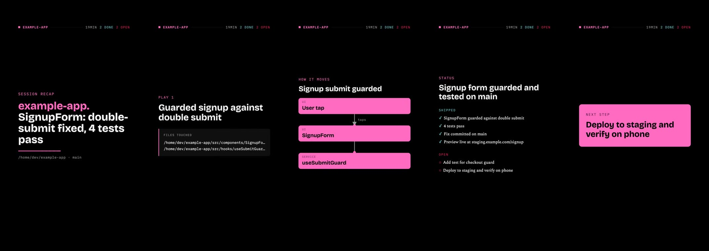

<p align="center"></p>

# Rik Rok

Tired of running six Claude Code or Codex sessions, then going back through every one to work out what it did and put yourself back in the loop?

Imagine if your recaps came at you the same way you doomscroll.

Welcome to Rik Rok.

<p align="center"><a href="https://github.com/alexferrao/rikrok/releases/tag/v0.5.0"></a></p>

Rik Rok watches your coding-agent sessions. When one goes idle after real work, it writes a 30 to 45 second news-style recap, narrates it in your own voice, renders a vertical reel, and drops it into a swipe feed on your phone. Every reel ends with the single next step for that project, and when the session changed how something moves, the reel shows the flow. Reply to a reel and the comment can go straight back to the agent.

Everything runs on your machine. Sessions are read from disk, scripts come from a local LLM, narration from a 20-second recording of you, rendering from Remotion. No cloud, no accounts, no telemetry. Your voice never leaves the machine.

## Get started

Three ways to run it. Pick one; they all end in the same feed.

| | Scripts written by | Voice | Needs | Best for |
|---|---|---|---|---|
| **1. Claude writes it** (easiest) | Claude Code, headless, on your subscription | your own voice via `rikrok voice serve`, or the Mac voice | Claude Code installed, ffmpeg | anyone already using Claude Code |
| **2. Local model** | Ollama or LM Studio | same | a local model server | keeping recaps entirely offline |
| **3. Mac, one server** | oMLX | oMLX (same server) | Apple Silicon, oMLX | one process for scripts, voice and QA |

The session already went through Claude, so asking Claude to write the recap adds nothing new; the voice and the render stay on your machine in every option.

### 1. Claude writes it

```bash
npm install -g rikrok        # or: npx rikrok ...
rikrok setup                 # answers: yes to Claude writing the recaps, yes to the hook, record your voice
```

That is the whole setup. From then on, when you leave a Claude Code session that did real work, a reel is built in the background and appears in the feed. By hand, the same thing is:

```bash
rikrok hook install          # SessionEnd hook: recap when you leave a session
rikrok voice setup           # 22 seconds of you, see "Your own voice"
rikrok voice serve           # a local cloning server, or skip and use the Mac voice for now
rikrok feed                  # http://127.0.0.1:4870
rikrok install               # keep the feed (and voice server) running at login
```

`rikrok watch` is the alternative trigger: it recaps sessions that go idle for 15 minutes, hook or no hook. Use both if you tend to leave sessions open.

Want to see one first? `rikrok demo` renders a reel from a bundled sample session.

### 2. Local model

```bash
ollama pull qwen3:8b
export RIKROK_SCRIPT=local RIKROK_LLM_MODEL=qwen3:8b
export RIKROK_LLM_EXTRA='{"think":false}'    # thinking models: keep the JSON clean
rikrok backfill --limit 3 && rikrok feed
```

`rikrok setup` walks through this too (answer no to Claude writing the recaps). LM Studio works the same way on port 1234. No model reachable? Reels still ship with a plain template script built from commits, files and todos.

### 3. Mac, one server: oMLX

See "One server on a Mac: oMLX" under Configuration. `rikrok setup` finds it and wires everything.

## When does a session earn a reel?

Two triggers, same rules. The hook fires when you leave a session; the watcher catches sessions left open that go quiet. Neither reads a session while you are typing in it. Then the same checks: real work, and only what is new since the last recap.



| Rule | Value | Why |
|---|---|---|
| Idle bar | 15 min | No new lines in the log. A resumed session that goes quiet again gets a second reel covering only the new lines. |
| Real work | 10 assistant turns, 3 tool calls | Below this the session is remembered but skipped, so a quick question never becomes a reel. |
| Backlog cutoff | 48 h | Older sessions are history, not news. The first run backfills the 10 most recent instead. |
| Rate limit | 4 an hour | A reel costs an LLM call, a handful of voice clips and a render. The rest queue for the next scan. |
| Retries | 5 | LLM or voice server down: back off 2, 4, 8, 16, 32 minutes, then give up for this idle period. |

All five are settings (`RIKROK_IDLE_MINUTES`, `RIKROK_MIN_TURNS`, `RIKROK_MIN_TOOLS`, `RIKROK_MAX_PER_HOUR`).

## What goes into the script?

The log is condensed to about a page of evidence and handed to the script writer (Claude Code headless, or your local model) with a fixed grammar. If the model fails twice, a template writes the same shape from the raw facts. A reel always ships.



The script is the only creative step. Everything after it is timing: each card stays up as long as its narration runs, never under 2.2 seconds.

## The reel, beat by beat

Frames from the demo reel (a sample session). Every reel has this order; only the number of plays varies, two to four, and the flow beat appears only when the session changed how something moves. Click the strip for full size.

<a href="assets/readme/beats.jpg"></a>

1. **Headline.** The outcome up front. Project name in its fixed accent colour, the one-line result, and a score bug: minutes active, done, open. Under it, the repo path and branch. Headline and narration come from the model; path, branch and minutes are facts from the log.
2. **Play** (two to four). One thing that happened. A caption plus an evidence panel: files touched, commit lines, commands or a quote, animating in one by one. The model picks the plays; evidence lines must come from the log, never invented.
3. **How it moves.** The flow the session built or changed: a user action reaching an API, data written somewhere, a job firing. Nodes in the order things happen, arrows drawn in as the narration reaches them, a dot travelling each arrow, the changed parts lit in the accent. The model returns nodes and edges backed by the session. Off with `RIKROK_FLOW=off`.
4. **Status.** Where it stands. Shipped in cyan with ticks, open in red with circles. If the previous recap named a next step, the narration says whether it happened.
5. **Next step.** The single next action on an accent card. Also printed under the reel in the feed, so you can act without replaying.

## What you can do on a reel

| Action | How | What happens | Talks back to the agent? |
|---|---|---|---|
| Watched | double-tap, button, or 80% played | Reel drops below unwatched ones. Saved next to the video. | no |
| 2x | hold anywhere | Plays at double speed while held. | no |
| Comment | speech bubble | Saved to the reel, then handed to your hook with the session id, lines covered, newer recaps, and a resume hint. | yes, through `RIKROK_COMMENT_HOOK` |
| Archive | button | Hidden from the feed. The feed also auto-archives past 3 unwatched per project. | no |
| Chain | badge | Shows when a newer recap of the same session exists; tap jumps to it. | no |
| Details | button | Shipped, open, commits, URLs, copy path. | no |

## On your phone

The feed binds to `127.0.0.1` by default. To reach it from your phone, put it on a private network you already trust:

- Tailscale: `RIKROK_BIND=0.0.0.0 rikrok feed`, then open `http://<your-mac>.<tailnet>.ts.net:4870`. If your tailscaled runs in userspace mode, use `tailscale serve --bg --https=8445 http://127.0.0.1:4870` instead and open the https URL.
- Same Wi-Fi: `RIKROK_BIND=0.0.0.0 rikrok feed` and open `http://<mac-ip>:4870`.
- Behind a Cloudflare tunnel with Access in front works well too.

Add it to your home screen from the share sheet for the full-screen PWA. There is no login on the feed, so do not expose it to the public internet without something in front.

Data lives in `~/.rikrok` (reels, sidecar JSON, state, render bundle, logs). Delete it to start over.

## Configuration

Environment variables, or the same keys in `~/.rikrok/config.json`. `rikrok config` prints what is in effect.

| Variable | Default | What it does |
|---|---|---|
| `RIKROK_HOME` | `~/.rikrok` | Data directory |
| `RIKROK_CLAUDE_DIR` | `~/.claude/projects` | Where Claude Code keeps sessions |
| `RIKROK_SCRIPT` | `auto` | Who writes the script: `claude` (headless Claude Code), `local` (server below), `auto` = local if a model is set, else Claude if the CLI exists |
| `RIKROK_CLAUDE_MODEL` / `_BIN` | `sonnet` / `claude` | Model alias and binary for the Claude path |
| `RIKROK_LLM_URL` | `http://127.0.0.1:11434` | OpenAI-compatible chat server (Ollama, LM Studio, oMLX, vLLM) |
| `RIKROK_LLM_MODEL` | unset | Model name. Unset means template scripts only |
| `RIKROK_LLM_KEY` | unset | Bearer token if your server wants one |
| `RIKROK_LLM_EXTRA` | `{}` | JSON merged into every chat request, e.g. `{"think":false}` (Ollama) or `{"chat_template_kwargs":{"enable_thinking":false}}` (oMLX, vLLM) |
| `RIKROK_FLOW` | `on` | `off` drops the "how it moves" beat |
| `RIKROK_VOICE` | `say:Samantha` on macOS, else `none` | `clone` (your voice), `say:<Voice>`, `openai-speech:<voice>`, `module:<path>`, `none` |
| `RIKROK_CLONE_REF` / `_TEXT` / `_MODEL` | `~/.rikrok/voice/ref.wav`, `ref.txt`, `Qwen3-TTS-12Hz-1.7B-Base-bf16` | Reference clip, its transcript, and the cloning model on your speech server |
| `RIKROK_CLONE_API` | `speech` | `voice-clone` for servers with a dedicated `/v1/audio/voice-clone` endpoint (set by `rikrok voice serve`) |
| `RIKROK_VOICE_PORT` | `4873` | Port for `rikrok voice serve` |
| `RIKROK_TTS_URL` / `_MODEL` / `_KEY` | LLM URL, `tts-1` | For `openai-speech`: any `/v1/audio/speech` server (Kokoro-FastAPI, oMLX Qwen3-TTS, LM Studio) |
| `RIKROK_VOICE_FX` | `none` | `light` or `strong` robot treatment |
| `RIKROK_STT_URL` / `_MODEL` / `_KEY` | unset | Enable transcribe-back QA via a `/v1/audio/transcriptions` server with word timestamps |
| `RIKROK_PORT` / `RIKROK_BIND` | `4870` / `127.0.0.1` | Feed address |
| `RIKROK_COMMENT_HOOK` | unset | Shell command run for every comment, JSON on stdin (see below) |
| `RIKROK_IDLE_MINUTES` / `_MIN_TURNS` / `_MIN_TOOLS` | `15` / `10` / `3` | What counts as a finished, meaningful session |
| `RIKROK_MAX_PER_HOUR` | `4` | Watcher rate limit |
| `RIKROK_PROJECT_NAME_RE` | unset | Regex with one capture group applied to the session cwd to name the project, e.g. `workspaces/([^/]+)/` for worktree layouts |
| `RIKROK_HANDLE` | unset | Handle shown on every reel |
| `RIKROK_BROWSER` | unset | Path to a Chrome or Chromium binary if you would rather not let Remotion download one |

### Your own voice

```bash
rikrok voice setup           # reads you a two-line script, records 22 seconds, plays it back, done
rikrok voice setup --file me.wav --text "what I say in it"   # or bring a clip you already have
rikrok voice test            # say a line in your voice
```

There is no training. The clip and its transcript are stored in `~/.rikrok/voice` and sent with every request to a local speech server that does zero-shot cloning. Nothing is uploaded anywhere.

You need a speech server that can clone. The easy way:

```bash
rikrok voice serve           # installs and runs a local Qwen3-TTS server on :4873 (MLX on Apple Silicon)
rikrok voice serve --fast    # the 0.6B model: smaller download, quicker, a little less like you
```

New in 0.4.0 and lightly tested so far; please open an issue with what breaks. It needs [uv](https://docs.astral.sh/uv/) and git, downloads the model from Hugging Face on first start (about 4.5 GB, or 1.5 GB for `--fast`), and points Rik Rok at itself. `rikrok install` keeps it running at login alongside the watcher and the feed. The server is the Apache-2.0 [Qwen3-TTS OpenAI FastAPI project](https://github.com/groxaxo/Qwen3-TTS-Openai-Fastapi); on Linux and Windows it runs on PyTorch (CPU unless you set `TTS_DEVICE=cuda`).

Already running something that clones? Any server that takes `ref_audio` and `ref_text` on `/v1/audio/speech` (oMLX with Qwen3-TTS, for example) works with `RIKROK_TTS_URL` and `RIKROK_CLONE_MODEL`; set `RIKROK_CLONE_API=voice-clone` for servers that use the dedicated `/v1/audio/voice-clone` endpoint instead.

### One server on a Mac: oMLX

If you are on Apple Silicon and want the least moving parts, run [oMLX](https://github.com/jundot/omlx) (Apache-2.0, menu-bar app). One instance serves the script model, the Qwen3-TTS cloning model and whisper for narration QA on a single port, which is how Rik Rok's author runs it.

1. Install: download the `.dmg` from oMLX's releases, or `brew install jundot/omlx/omlx`. The welcome screen picks a model folder and starts the server.
2. In oMLX's model downloader, add a chat model (for example `mlx-community/Qwen3.5-35B-A3B-4bit` if you have the memory, or a 4B to 9B Qwen3.5 otherwise), `mlx-community/Qwen3-TTS-12Hz-1.7B-Base-bf16` for your voice, and a whisper model such as `whisper-large-v3-turbo`.
3. `rikrok setup`. It finds oMLX on :8000 or :8800, copies the API key from `~/.omlx/settings.json`, picks the models it finds, and records your voice. Thinking is switched off for the script model automatically.

### Other voices

- `say:Samantha` (any voice from `say -v ?`): zero setup on a Mac, the fallback while your voice is not set up.
- `openai-speech:<voice>`: point `RIKROK_TTS_URL` at a local speech server. Kokoro-FastAPI, oMLX with Qwen3-TTS presets, and LM Studio all speak this API.
- `module:/path/to/voice.mjs`: your own engine. Export `{ name, available(), synth(text, outWavPath) }`. This is how a private voice clone stays private.
- `none`: silent reels, captions carry the story.

If the configured voice is unavailable, Rik Rok falls back to `say`, then to silence, and says so in the sidecar. The default voices are there so a reel always ships; the point is your own.

### Comment hook

Set `RIKROK_COMMENT_HOOK` to any command. For each comment it receives JSON on stdin:

```json
{ "reelId": "…", "source": "claude", "sessionId": "…", "project": "my-app", "cwd": "/Users/me/my-app",
  "headline": "my-app: signup guarded", "coveredLines": { "from": 0, "to": 214 },
  "newerRecaps": [], "resumeHint": "claude --resume <id>", "comment": "also cover checkout", "at": "…" }
```

A hook that opens the session back up with your note:

```bash
RIKROK_COMMENT_HOOK='jq -r ".comment" | xargs -I{} claude --resume "$(jq -r .sessionId)" -p "{}"'
```

Comments are always saved to the reel's sidecar JSON as well.

## Privacy

With "Claude writes it", the condensed evidence (about a page: your last prompts, the assistant's notes, file names, commands, git log) goes to Claude through your own Claude Code login, the same place the session itself already went. With a local model, nothing leaves the machine. Either way the voice clip, the narration and the render stay local unless you point `RIKROK_TTS_URL` at a remote server. The reels themselves contain session content (file names, commit lines, what you asked for), so share them the way you would share a terminal recording.

## Requirements

- Node 20.19 or newer
- ffmpeg and ffprobe
- git
- A headless Chrome for rendering. Remotion downloads one on first use (a few hundred MB); `rikrok demo` triggers that download so the first real reel is not a surprise. If the download does not work on your machine, set `RIKROK_BROWSER` to any Chrome or Chromium.
- Remotion's licence applies to you as the user: free for individuals and for companies of up to three people, a paid company licence above that. See remotion.dev/license.

Linux: the watcher and feed run fine (`rikrok watch`, `rikrok feed`); `rikrok install` prints systemd user units instead of installing launchd agents. `say` is macOS only, so pick `openai-speech` or `none`.

## Roadmap

- Codex CLI sessions (`~/.codex/sessions`) as a second source. The source interface is already in place.
- Gemini CLI, OpenCode, Cursor.
- A screenshot of the running app as a play's visual when the session mentioned a live URL.
- Push notification when a reel lands.

## Development

```bash
git clone https://github.com/alexferrao/rikrok && cd rikrok && npm install
npm test                  # parse, script, flow and props tests on the fixture session
npm run demo              # full pipeline on the fixture: assets/demo.mp4
npm run studio            # Remotion studio for the composition
node scripts/gen-icon.mjs # regenerate the mark (macOS, needs Baskerville)
```

MIT.
